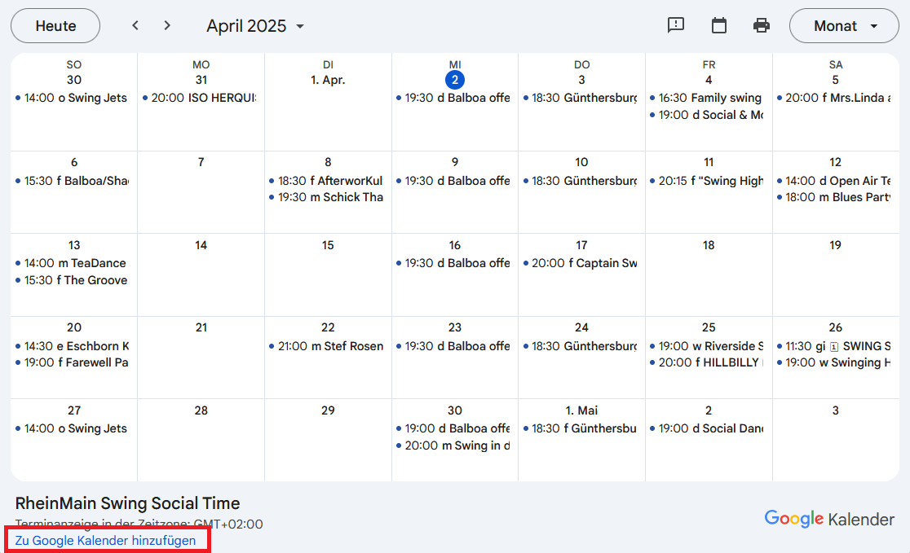

# Deine Tanzevents, immer dabei

Aktuell pflegen wir unsere Events – zusammen mit allen Helfern aus der Rhein-Main-Szene – in einem Google-Kalender, was es ganz einfach für dich macht, immer auf dem Laufenden zu bleiben.

## Wenn du ein Google-Konto hast

Öffne den Kalender-Link und klicke **rechts unten** auf den **Plus**-Button:

> https://calendar.google.com/calendar/u/0/embed?src=s1nbnfmv1lnfc013iuuqg94oo8@group.calendar.google.com

Das sollte dich zu deinem Google-Kalender bringen, wo du das Hinzufügen bestätigen kannst.

Hast du **Probleme** den Kalender zu sehen, musst du ihn vielleicht in [Googles Syncselect-Seite](https://calendar.google.com/calendar/u/0/syncselect) aktivieren. Häkchen machen, Rechts unten Speichern. Kalender aktualisieren. 🤞

## Ohne Google-Konto

Falls du kein Google-Konto hast, kannst du unseren Kalender trotzdem benutzen. Unter folgendem Link findest du die ".ics"-Adresse des Kalenders:

> https://calendar.google.com/calendar/ical/s1nbnfmv1lnfc013iuuqg94oo8%40group.calendar.google.com/public/basic.ics

Dieses Format wird unterstützt von vielen verschiedenen Kalender-Programmen, wie z.B. Outlook, Apple-Kalender ...

## Im Web

[Den Kalender-Link](https://calendar.google.com/calendar/u/0/embed?src=s1nbnfmv1lnfc013iuuqg94oo8@group.calendar.google.com)  kannst du dir auch bookmarken und einfach die Web-Ansicht benutzen.

Und zum Einbetten in eine Webseite: [gibts hier das Google-Kalender-Embedd-Tool](https://calendar.google.com/calendar/u/0/embedhelper?src=s1nbnfmv1lnfc013iuuqg94oo8%40group.calendar.google.com&ctz=Europe%2FBerlin).\
Wenn das öffentlich ist, wäre es allerdings nett, wenn wir [per mail](mailto:hallo@rmswing.de) informiert würden 🙂
