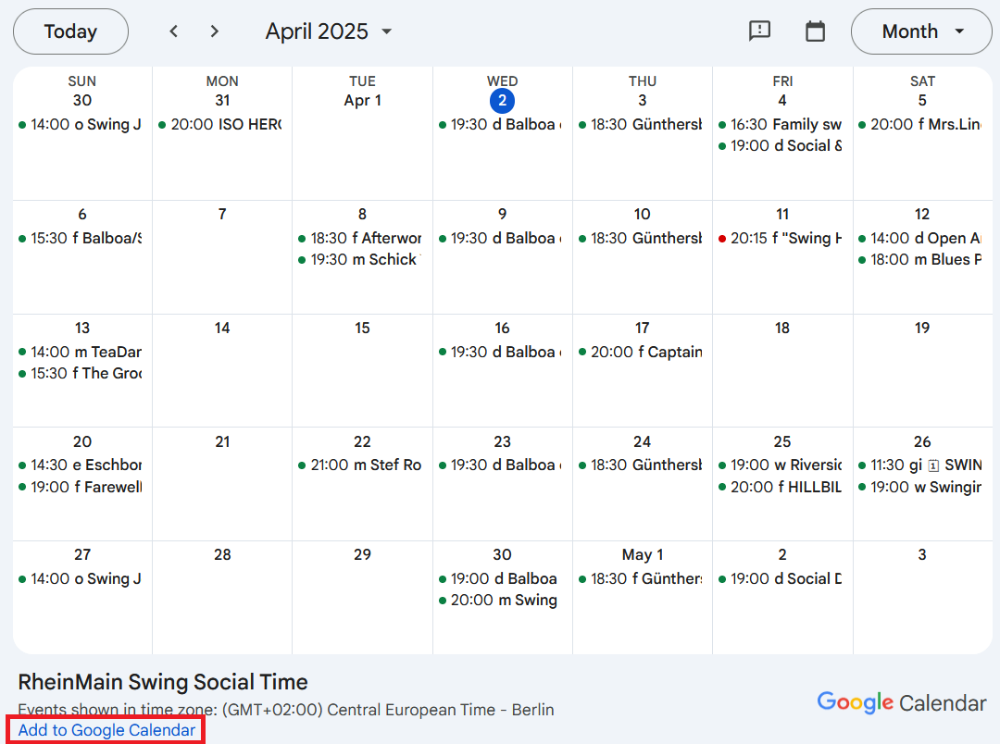

# Your dance events, always with you!

Currently we're managing (together with a trusty group of helpers) all our dance events within a google calender, which makes it easy for you to always stay up to date.

## If you have a Google account

Open the link "Our Calendar" and click on the **plus sign** in the **bottom right** corner.

> https://calendar.google.com/calendar/u/0/embed?src=s1nbnfmv1lnfc013iuuqg94oo8@group.calendar.google.com

If you have **trouble** seeing the calendar, you might need to activate it on the [Google Syncselect-page](https://calendar.google.com/calendar/u/0/syncselect). Tick the checkbox, hit "Save" on the bottom right. Reload calendar. 🤞

## Without a google account

If you don't have a google account, you can use the calendar nevertheless. The following link will take you to an "ICS file":

> https://calendar.google.com/calendar/ical/s1nbnfmv1lnfc013iuuqg94oo8%40group.calendar.google.com/public/basic.ics

Most calendar apps like Outlook, Apple Calendar or Thunderbird will handle without any problems.

## On the web

Google also offers a [web based view](https://calendar.google.com/calendar/embed?src=s1nbnfmv1lnfc013iuuqg94oo8%40group.calendar.google.com&ctz=Europe/Berlin&wkst=2&hl=de) off the calendar, which you can bookmark.

For embedding into a website: [there is a Google-Calendar-Embed-Tool](https://calendar.google.com/calendar/u/0/embedhelper?src=s1nbnfmv1lnfc013iuuqg94oo8%40group.calendar.google.com&ctz=Europe%2FBerlin).\
When put onto a public website, it'd be nice to be notified about it [via mail](mailto:hallo@rmswing.de) Thank you! 🙂
